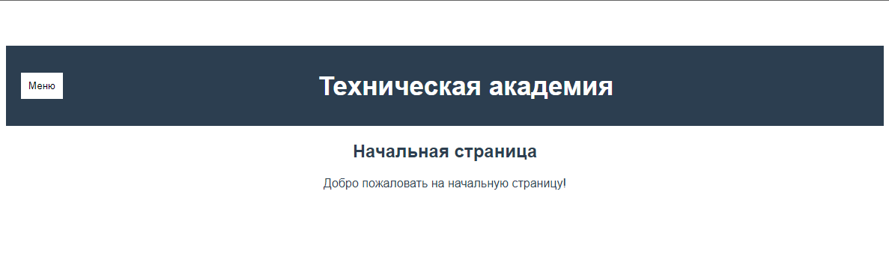
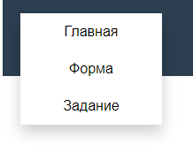
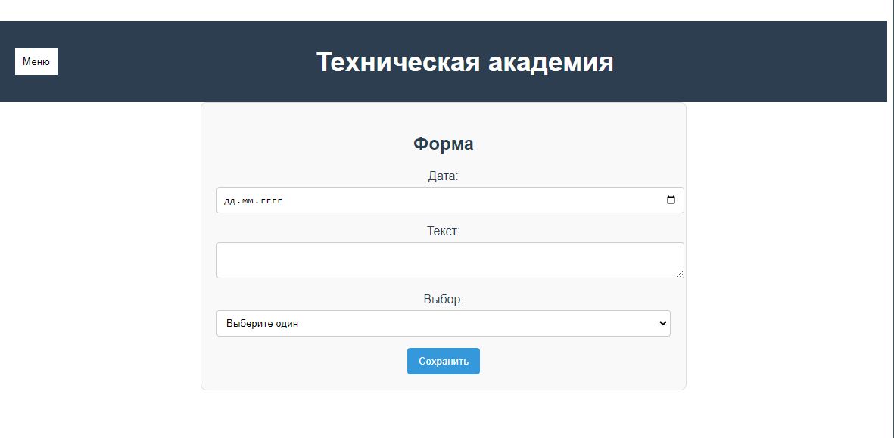
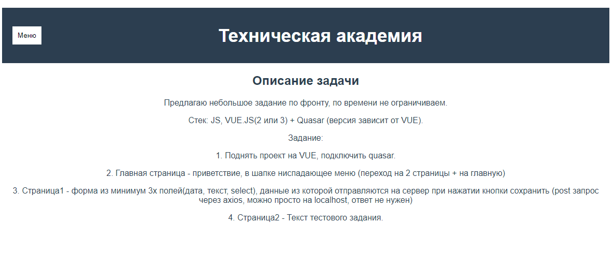
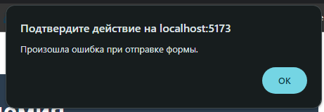
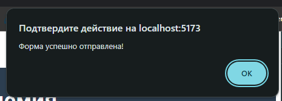

# Тестовое задание от Технической академии по JavaScript
#### Необходимо реализовать сайт-галерею, в которую администраторы сайта могут загружать фотографии, а посетители - просматривать их.
Стек:
JS, VUE.JS(2 или 3) + Quasar (версия зависит от VUE).

Задание:
1. Поднять проект на VUE, подключить quasar.

2. Главная страница - приветствие, в шапке ниспадающее меню (переход на 2 страницы + на
главную)

3. Страница1 - форма из минимум 3х полей(дата, текст, select),
данные из которой отправляются на сервер при нажатии кнопки сохранить
(post запрос через axios, можно просто на localhost, ответ не нужен)

4. Страница2 - Текст тестового задания.

## Как запустить проект
Клонировать репозиторий из GitHub:
```bash
git clone https://github.com/AksiniaFox/academy.git
```








